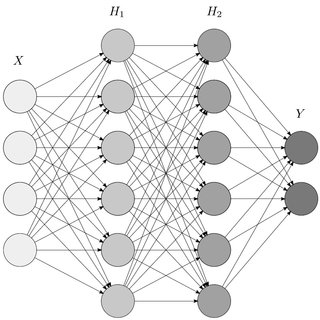
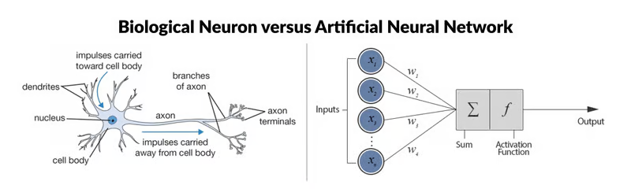
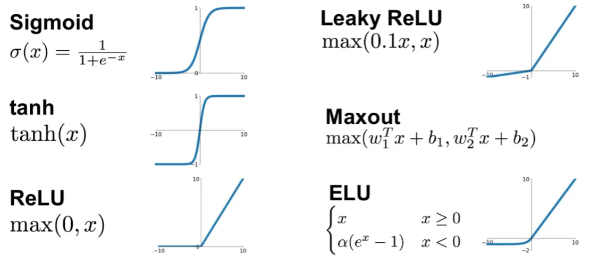
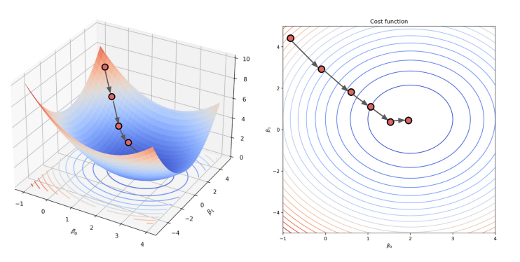

# Multi Layer Perceptron
A Multi Layer Perceptron (MLP) is a simple type of Feedforward Neural Network (FNN). These types of neural networks are relatively simple as information flows in a single direction: from input to output; there are no cycles/loops in its architecture.

## Perceptron (Neuron)
A neuron is the basic component of a neural network that performs a small calculation. In a MLP neural network these neurons are relatively simple and called "Perceptrons".

Each Neuron takes in a set of input values $x_1, x_2, ... , x_n$ (usually denoted by a vector $X$), and returns a single output value. Each Neuron has a set of weights $w_1, w_2, ... , w_n$ and a bias $b$, which it uses to calculate the output value $y$.

First a weighted sum of all the values of $x_i$ are taken, then the bias is added and finally an activation function $f_a$ is used in order to map all of the values to set range.

$$
y = f_a(\sum_{i=1}^n w_i x_i + b)
$$
### Activation Functions
A common activation function is $\text{tanh}(x)$, no matter what input value $x$ you provide, the output will always lie somewhere between 0 and 1.

The advantages of using an activation function:
* **Introduce Non-Linearity** - without the activation functions the output would be a simple linear-combination of the input values, which cannot model complex non-linear behavior
* **Control Output Range** - without the activation functions certain outputs (and gradients) could blow up to infinity or vanish to zero. This is a loss of data, and destabalizes training.
* **Better Gradient Descent** - The activation function allows the gradients to change non-linearly, allowing for faster learning through the gradient descent method.
* **Interprability** - In case of classification tasks it helps to keep the output values between 0 and 1, as these can be directly mapped to probabilities.

Some common activation functions:

## Layer
A single neuron will take an input vector, and convert that into an output value. To increase the complexity of the network a set of neurons (each with different weights and biases) can be used to create multiple output values. All of these output values can be stored in a list/array as an output vector. This way a Layer in a MLP neural network can receive an input vector, and calculate an output vector.

This allows data to be transformed during multiple stages before being returned as the network output (i.e. take an input vector $x# and create a prediction vector $\hat y$)

## Gradient Descent
The accuracy of the model can be determined by calculating the error of a prediction. The cost function $J$ represents how far off a model's prediction $\hat y_i$ is from the measured value $y$.

$$ J = \sum (\hat y - y)^2 $$

The prediction $\hat y$ is calculated by the model based on the input data ($x_1, x_2$) and the weights ($w_1, w_2, b$)

$$ s=w_1 x_1 + w_2 x_2 + b $$
$$ \hat y = \text{tanh}(s)$$

The model is most accurate when the loss $J$ is minimized. In order to reach this minimum value, each weight can be updated by changing the value of the weight by a small increment $h$ in the negative  direction of the gradient of $J$ with respect to a weight (i.e. move downhill).

$$ w_1^{\text{new}} = w_1 - h \cdot \frac{\partial J}{\partial w_1} $$

### Back Propagation
The gradient of the loss function with respect to a weight might seem like a complex calculation, which is where back propagation comes into play. At the end of the day the loss function is simply a set of operations being applied in order. $J$ is a function of the prediction $\hat y$, which itself is a function of the the weight sum $s$, which itself is a function of the weight in question $w_1$. This means the chain rule can be applied when determining the derrivative.

$$\frac{\partial J}{\partial w_1} = \frac{\partial J}{\partial \hat y}\cdot \frac{\partial \hat y}{\partial s}\cdot \frac{\partial s}{\partial \hat w_1}$$

It's called back propagation because you can start with calculating the first local gradient $\nabla \hat y$

$$\nabla \hat y = \frac{\partial J}{\partial \hat y}$$

This can be used to calculate the local derivative one level backwards $\nabla s$

$$\nabla s = \frac{\partial J}{\partial s} = \frac{\partial J}{\partial \hat y} \cdot \frac{\partial \hat y}{\partial s}$$
$$\nabla s = \nabla \hat y \cdot \frac{\partial \hat y}{\partial s}$$

This can be used to calculate the local derivatves one more level backwards

$$\nabla w_1 = \nabla s \cdot \frac{\partial s}{\partial w_1}$$
$$\nabla w_2 = \nabla s \cdot \frac{\partial s}{\partial w_2}$$
$$\nabla b = \nabla s \cdot \frac{\partial s}{\partial b}$$
